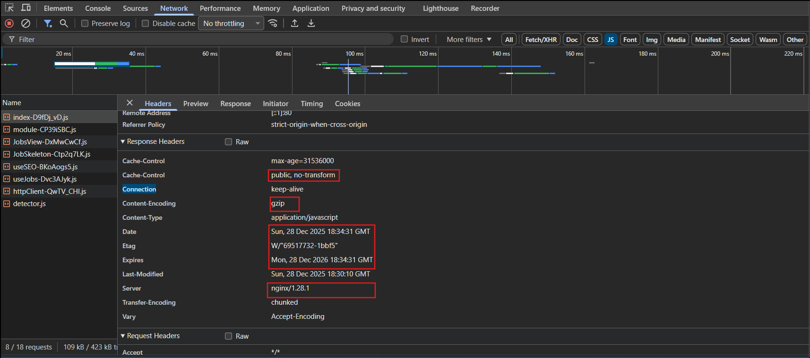
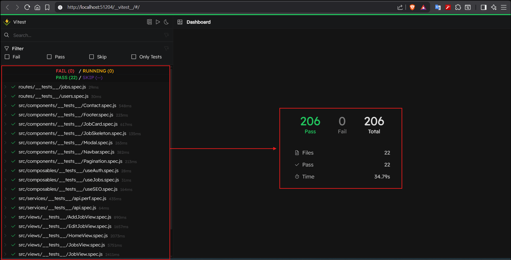
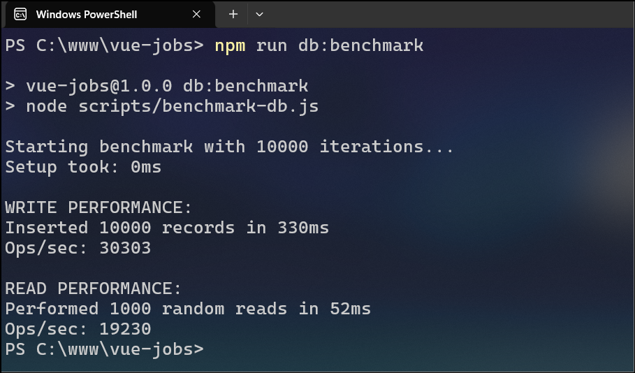
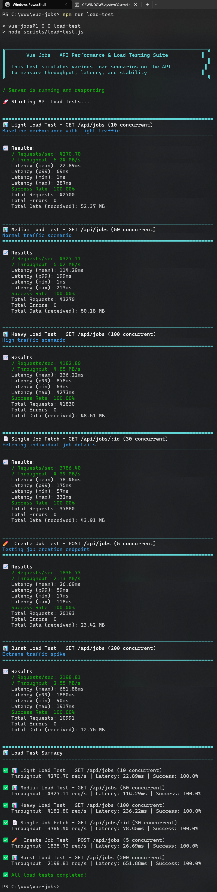

# Vue Jobs - Full Stack Application


A full-stack job board system using Vue.js 3 (Composition API) and Node.js / Express.js, following a clean RESTful architecture.
Designed and implemented secure authentication using JWT and bcrypt, ensuring safe session management and data protection.
Built and optimized a SQLite3 database with WAL mode, indexing, and normalized schema to improve reliability and concurrency.
Fully containerized with **Docker** and **Nginx** for consistent deployment across environments.
Implemented full CRUD functionality, job search and filtering, and a responsive UI using Tailwind CSS.
Applied security best practices including Helmet.js, rate limiting, CORS, and input validation.
Focused on code readability, maintainability, and scalability, with SEO and accessibility considerations.

---

## 🌐 Live Demo

**Link**: [https://vue-jobs-41cn.onrender.com](https://vue-jobs-41cn.onrender.com)

> [!NOTE]
> This application is currently hosted on **Render's Free Tier** for demonstration purposes.
>
> - **Performance**: You may experience a "cold start" (slower initial load) if the instance has been idle.
> - **Optimized Core**: While the hosting environment is limited, the application code is highly optimized for performance and will respond significantly faster on a production-grade server.

---

## 📖 Table of Contents

- [🚀 Features](#-features)
- [📋 Prerequisites](#-prerequisites)
- [🛠️ Installation](#-installation)
- [🏃 Running the Application](#-running-the-application)
- [🎨 Technology Stack](#-technology-stack)
- [💾 Database Migration](#-database-migration)
- [🛡️ Database Backup](#-database-backup)
- [📊 Error Monitoring](#-error-monitoring)
- [📁 Project Structure](#-project-structure)
- [🔌 API Endpoints](#-api-endpoints)
- [🧪 Testing](#-testing)
- [⚡ Performance Testing](#-performance-testing)
- [✅ Validation Strategy](#-validation-strategy)

---

## 🚀 Features

- **Vue 3** with Composition API
- **Vue Router** for SPA navigation
- **Vite** for fast development and building
- **Express.js** REST API backend
- **SQLite3** database for persistent storage
- **Tailwind CSS** for styling
- Full CRUD operations (Create, Read, Update, Delete)
- Job search and filtering
- Responsive design
- **User Authentication**:
  - **Register & Login** functionality
  - **HttpOnly Cookies** for secure JWT session management (Protected against XSS)
  - **Password Hashing** with bcryptjs
  - **Global Auth State** (Vue Composition API)
  - **Dynamic Navbar** (Login/Logout/Greeting)
- **Security Enhanced**:
  - **HttpOnly Cookies**: Prevents client-side JavaScript from accessing session tokens
  - **Helmet.js** for secure HTTP headers (Backend security enhancements)
  - **Rate Limiting** to prevent abuse (100 req/15min)
  - **Input Validation** & Sanitization (express-validator)
  - **CORS** configured for safety with credential support
  - **Protected Routes** (Frontend checks)
- **Validation Strategy (Dual-Layer)**:
  - **Frontend**: **Zod** schemas provide instant, user-friendly feedback without server round trips.
  - **Backend**: **express-validator** ensures data integrity and security, acting as the final gatekeeper.
  - **Synchronization**: Rules (e.g., character limits) are strictly synchronized between frontend schemas and backend logic.
- **Database Optimizations**:
  - **WAL Mode** enabled for better concurrency
  - **Synchronous NORMAL** for faster writes
  - **Indexes** for optimized query performance
- **Modern UI/UX Features**:
  - **Loading Skeletons**: Visual placeholders with **smooth transition animations**
  - **Dynamic Search**: Enhanced job filtering and real-time updates
  - **Responsive Pagination**: Efficiently handle large datasets with a professional UI design, mobile-optimized UI with **items per page state persistence** (Local Storage)
  - **Shared State & Caching**: Centralized job state management with intelligent caching to prevent redundant API calls across routes
  - **Standardized API Client**: Custom fetch wrapper with interceptor pattern for auth and error handling
  - **Layout Stability**: Optimized scrollbars to prevent layout shifts
  - **Global Loader**: Component-level loader for improved user experience
  - **Custom Scrollbar**: Branded green theme for a premium feel
  - **Font Awesome** icons for visual cues
  - Custom SVG illustrations for Auth pages
  <!-- - **Interactive Contact Page**: Functional form UI with validation and email simulation -->
  - **Accessibility** (ARIA labels, semantic HTML)
- **Frontend Validation**:
  - Real-time error feedback for forms
  - User-friendly validation alerts
- **SEO Optimized**:
  - Dynamic meta tags for all pages
  - Open Graph & Twitter Card support
  - Schema.org structured data (JobPosting, WebSite)
  - Semantic HTML with ARIA labels
  - robots.txt and XML sitemap
  - Google Jobs integration ready
- **Deployment & DevOps**:
  - **Docker** containerization for Backend & Frontend
  - **Nginx** reverse proxy and static file serving
  - **Nginx Optimizations**:
    - **Gzip Compression**: Enabled for HTML, CSS, JS, and JSON to reduce network payload size.
    - **Browser Caching**: Implemented long-term caching (1 year) for static assets (JS, CSS, images) using Vite's hashed filenames.
    - **Cache Integrity**: Configured `index.html` with `no-cache` to ensure users always receive the latest application version.
  - **Docker Compose** orchestration
  - **Multi-stage builds** for highly optimized, small-footprint images (npm ci, production-only deps)
- **Database Migration**:
  - Production-ready script to import data from external SQLite files
  - Transaction-safe with automatic rollbacks
- **Database Backup**:
  - Reliable WAL-aware backup utility (`npm run db:backup`)
  - Automatic timestamped backups every 60 minutes
  - Secure storage in `db/db_backup/` with Git-ignore protection
- **Error Monitoring & Analytics**:
  - **PostHog** integration for real-time error tracking
  - **Session Recording** to replay user behavior leading to errors
- **Experimental Features & Future Plans**:
  This project serves as a playground for experimenting with various technologies aiming to simulate a real-world, production-ready web application.
  - **TypeScript**: TypeScript is currently in the testing phase and experimented on the `feature/typescript` branch only. It might be included in the main branch in the future based on the project's need and complexity.
  - **Bun**: Experimental support for [Bun](https://bun.sh/) is available on the `feature/bun` branch.

## 📋 Prerequisites

- Node.js (v22 or higher)
- npm or bun (checkout to 'feature/bun branch' to test bun implementation)

## 🛠️ Installation

1. **Clone or navigate to the project directory:**

   ```bash
   cd /vue-jobs
   ```

2. **Install dependencies:**
   ```bash
   npm install
   ```
3. **Environment Variables:**
   Create a `.env` file (optional for local, required for JWT secret in production):
   ```env
   JWT_SECRET=your_super_secret_key
   PORT=3000
   ```

## 🏃 Running the Application

### Option 1: Run Both Servers Concurrently (Recommended)

```bash
npm start
```

This will start both the backend API server and the Vue dev server.

### Option 2: Run Servers Separately

**Terminal 1 - Backend Server:**

```bash
npm run server
```

The API will be available at `http://localhost:3000`

**Terminal 2 - Frontend Dev Server:**

```bash
npm run dev
```

The Vue app will be available at `http://localhost:5173`

### Option 3: Run with Docker (Production-Ready)

This will spin up the backend, frontend (Nginx), and database in containers.

To build for the first time or after making changes

```bash
docker-compose up --build
```

To run without building

```bash
docker-compose up
```

- **Frontend**: `http://localhost:80` (or just `http://localhost`)
- **Backend API**: `http://localhost:3000`

#### 🔍 Verifying Nginx Optimizations

When running with Docker, we can verify that Gzip and Caching are working:

1.  **Open the site**: Go to `http://localhost`.
2.  **Open DevTools**: Press `F12` and go to the **Network** tab.
3.  **Refresh**: Trigger a fresh load (`Ctrl + R`).
4.  **Check Headers**:
    - Click on a `.js` or `.css` file (e.g., `index-D7...js`).
    - **Compression**: Look for `Content-Encoding: gzip` in Response Headers.
    - **Caching**: Look for `Cache-Control: public, no-transform` and `expires` set to 1 year in the future.
    - **Instant Updates**: For `index.html`, verify `Cache-Control: no-cache, no-store, must-revalidate` to ensure users always check for the latest build.


### 🔑 Admin Credentials (Auto-Generated)

On the first run, the system automatically creates an Admin user:

- **Email**: `admin@mail.com`
- **Password**: `admin`

### 👤 Test User Credentials (Auto-Generated)

- **Email**: `test@mail.com`
- **Password**: `testuser`

You can use these credentials to log in immediately.

### 💾 Database Migration

Import data from an external `.db` file into your project database:

```bash
npm run db:import path/name.db
```

This script:

- Transfers **Users** and **Jobs**.
- Skips duplicates automatically.
- Ensures data integrity using database transactions.

### 🛡️ Database Backup

Reliably back up your database even when running in WAL mode:

```bash
npm run db:backup
```

This utility:

- **Flushes WAL Data**: Ensures all "in-flight" changes are merged into the backup.
- **Timestamped Filenames**: Saves as `YYYY_MM_DD_HH_MM_SS_database.db`.
- **Organized Storage**: All backups are kept in `db/db_backup/`.
- **Automatic Backups**: The server runs this backup process automatically every **60 minutes** while running (kept in 60 minutes to verify functionality, plan to change this to 12/24 hours).

### 📊 Error Monitoring ([PostHog](https://us.posthog.com/))

The application uses **[PostHog](https://us.posthog.com/)** for real-time error monitoring and session replays.

**Setup:**

1.  Added credentials to `.env` for this project.
2.  Errors are automatically captured by the global Vue error handler and sent to the PostHog dashboard.

**Check Behavior:**

- **Error Tracking**: View real-time errors and exceptions in the **Project > Behavior > Error tracking** tab from the PostHog dashboard.
- **Session Replay**: Watch user interactions leading up to an error in the **Project > Behavior > Session replay** tab from the PostHog dashboard.

### Testing CRUD Operations

**Create**: Navigate to "Add Job" and fill out the form

**Read**: View all jobs on Jobs page, click any job for details

**Update**: Click "Edit Job" on job details page

**Delete**: Click "Delete Job" on job details page (with confirmation)

## 📁 Project Structure

```
vue-jobs/
├── db/
│   ├── benchmark.db         # Database for benchmarking
│   ├── database.js          # Database connection and initialization
│   └── database.db          # SQLite database file (auto-generated)
├── nginx/
│   └── default.conf         # Nginx configuration
├── public/
│   └── images/              # Static images
├── routes/
│   ├── jobs.js              # API routes for jobs
│   └── users.js             # API routes for authentication (Login/Register/Logout)
├── scripts/
│   ├── backup-db.js         # Reliable WAL-aware backup utility
│   ├── benchmark-db.js      # Database benchmarking script
│   ├── load-test.js         # API load testing script
│   └── migrate-from-db.js   # Production-level migration utility
├── src/
│   ├── assets/
│   │   └── styles.css       # Tailwind CSS styles
│   ├── components/
│   │   ├── Navbar.vue       # Navigation component
│   │   ├── JobCard.vue      # Job card component
│   │   ├── Modal.vue        # Reusable modal component
│   │   ├── Footer.vue       # Site footer
│   │   ├── Contact.vue      # Contact form component
│   │   ├── Pagination.vue   # Pagination controls
│   │   └── JobSkeleton.vue  # Loading state component
│   ├── composables/
│   │   ├── useAuth.js       # Authentication & session state management
│   │   ├── useJobs.js       # Shared jobs state and caching logic
│   │   └── useSEO.js        # SEO meta tags management
│   ├── views/
│   │   ├── HomeView.vue     # Home page
│   │   ├── JobsView.vue     # All jobs listing
│   │   ├── JobView.vue      # Single job details
│   │   ├── AddJobView.vue   # Add new job form
│   │   ├── EditJobView.vue  # Edit job form
│   │   ├── LoginView.vue    # Login page
│   │   ├── RegisterView.vue # Registration page
│   │   └── NotFoundView.vue # 404 page
│   ├── router/
│   │   └── index.js         # Vue Router configuration
│   ├── schemas/
│   │   ├── auth.js          # Authentication validation schemas
│   │   ├── contact.js       # Contact form validation schema
│   │   └── job.js           # Job validation schema
│   ├── services/
│   │   ├── api.js           # API service layer (Job operations)
│   │   └── httpClient.js    # Interceptor-based fetch wrapper
│   ├── App.vue              # Root component
│   └── main.js              # Vue app entry point
├── .dockerignore            # Docker ignore file
├── .env                     # Environment variables
├── Dockerfile               # Backend Dockerfile
├── Dockerfile.frontend      # Frontend Dockerfile
├── docker-compose.yml       # Docker Compose configuration
├── server.js                # Express server
├── vite.config.js           # Vite configuration
├── package.json             # Dependencies and scripts
└── index.html               # HTML entry point
```

## 🎨 Technology Stack

| Layer               | Technology                        | Version           |
| ------------------- | --------------------------------- | ----------------- |
| Frontend Framework  | Vue.js 3 (Composition API)        | v3.5.25           |
| Build Tool          | Vite                              | v7.2.7            |
| Routing             | Vue Router 4                      | v4.6.4            |
| State Management    | Reactivity API (useAuth, useJobs) | -                 |
| Styling             | Tailwind CSS                      | v4.1.18           |
| Testing Framework   | Vitest                            | v4.0.16           |
| Test Utils          | @vue/test-utils                   | v2.4.6            |
| Backend             | Node.js + Express                 | v22.20.0 / v5.2.1 |
| Validation (Client) | Zod                               | v4.2.1            |
| Validation (Server) | express-validator                 | v7.2.0            |
| Authentication      | HttpOnly Cookies + JWT + bcryptjs | v9.0.3 / v3.0     |
| Database            | SQLite3                           | v5.1.7            |
| HTTP Client         | Custom Fetch (Interceptors)       | v1.0.0            |
| Deployment          | Docker + Docker Compose           | -                 |
| Web Server          | Nginx                             | Alpine Latest     |
| Monitoring          | PostHog                           | v1.309.1 (JS SDK) |

## 🔌 API Endpoints

| Method | Endpoint          | Description          |
| ------ | ----------------- | -------------------- |
| GET    | /api/jobs         | Get all jobs         |
| GET    | /api/jobs/:id     | Get single job by ID |
| POST   | /api/jobs         | Create new job       |
| PUT    | /api/jobs/:id     | Update job           |
| DELETE | /api/jobs/:id     | Delete job           |
| POST   | /api/users/logout | Clear auth cookie    |

## 💾 Database Schema

The `jobs` table includes:

- `id` - Primary key (auto-increment)
- `type` - Job type (Full-Time, Part-Time, Remote, Internship)
- `title` - Job title
- `description` - Job description
- `salary` - Salary range
- `location` - Job location
- `company_name` - Company name
- `company_description` - Company description
- `contact_email` - Contact email (required)
- `contact_phone` - Contact phone (optional)
- `created_at` - Timestamp

## 🎨 Features Walkthrough

1. **Home Page** - Hero section with featured jobs (first 3 jobs)
2. **Jobs Page** - All jobs with search/filter functionality
3. **Job Details** - View full job information with edit/delete options
4. **Add Job** - Form to create new job listings
5. **Edit Job** - Update existing job information
6. **Delete Job** - Remove job listings

## 🧪 Testing

The project includes comprehensive test coverage using **Vitest**, a blazing-fast unit test framework optimized for Vite projects.

### Running Tests

**Run all tests once:**

```bash
npm run test -- --run
```

**Run tests in watch mode (auto-rerun on file changes):**

```bash
npm test
```

**Run tests with UI dashboard:**

```bash
npm run test:ui
```

This opens an interactive dashboard where you can:

- View all test files and their results
- Filter and search specific tests
- Re-run individual tests or suites
- See code coverage visualization

**Generate coverage report:**

```bash
npm run test:coverage
```

### Test Coverage

The project includes comprehensive test coverage with **206 tests** across **22 test files** covering:

**Frontend Views (94 tests):**

- ✅ HomeView - Landing page rendering and navigation
- ✅ JobsView - Job listing, search, and filtering
- ✅ JobView - Individual job details display
- ✅ AddJobView - Job creation form
- ✅ EditJobView - Job editing form
- ✅ RegisterView - User registration form
- ✅ LoginView - User login form
- ✅ NotFoundView - 404 error page

**Components (36 tests):**

- ✅ Navbar - Navigation component
- ✅ JobCard - Job listing card
- ✅ Modal - Reusable modal dialog
- ✅ Pagination - Page navigation logic
- ✅ JobSkeleton - Loading state placeholders
- ✅ Footer - Copyright, links, and rendering
- ✅ Contact - Form states and validation

**Services (10 tests):**

- ✅ API Service - REST API integration and error handling

**Composables (20 tests):**

- ✅ useAuth - Authentication state management
- ✅ useJobs - Job data fetching, caching, and error handling
- ✅ useSEO - Dynamic meta tags and SEO

**Backend Routes (46 tests):**

- ✅ Jobs Routes - CRUD operations and validation
- ✅ Users Routes - Authentication endpoints

### Test Architecture

- **Framework**: Vitest with jsdom environment
- **Component Testing**: @vue/test-utils for Vue component mounting
- **API Mocking**: vi.mock() for isolating components and services
- **Patterns**: Consistent mock setup across all test suites
- **Assertions**: Behavior-based testing (what users experience)
- **Stability**: Updated test cases with increased timeouts and resolved warnings for consistent execution



## ⚡ Performance Testing

The project includes a **comprehensive performance testing suite** with multiple testing approaches, detailed documentation, and real-world benchmarks.

### Quick Start - Run Tests Now

```bash
# Performance benchmark tests (15 tests, all passing ✅)
npm run test -- src/services/__tests__/api.perf.spec.js --run
```

```bash
# Database performance benchmark
npm run db:benchmark
```



```bash
# API load testing (requires server running in another terminal)
npm run load-test
```



### Performance Documentation

**Choose your entry point:**

| Document                                                                                     | Purpose                         | Time   | Best For               |
| -------------------------------------------------------------------------------------------- | ------------------------------- | ------ | ---------------------- |
| [**PERFORMANCE_START_HERE.md**](./performance/PERFORMANCE_START_HERE.md)                     | Complete overview & quick start | 5 min  | Everyone - start here! |
| [**PERFORMANCE_QUICK_START.md**](./performance/PERFORMANCE_QUICK_START.md)                   | Commands & performance targets  | 5 min  | Quick reference        |
| [**PERFORMANCE_TESTING_GUIDE.md**](./performance/PERFORMANCE_TESTING_GUIDE.md)               | Comprehensive 5-part guide      | 30 min | Deep understanding     |
| [**PERFORMANCE_IMPLEMENTATION_GUIDE.md**](./performance/PERFORMANCE_IMPLEMENTATION_GUIDE.md) | Code examples & templates       | 25 min | Creating custom tests  |
| [**PERFORMANCE_TESTING_SUMMARY.md**](./performance/PERFORMANCE_TESTING_SUMMARY.md)           | Implementation details          | 15 min | What's included        |

### Test Coverage

✅ **15 Performance Tests** - API data processing

- Filter operations (0.1-0.4ms)
- Sort operations (2.9-19.1ms)
- Pagination (0.03ms)
- JSON serialization/parsing
- Memory profiling
- Throughput measurement

✅ **Database Benchmarking** - SQLite optimization

- 10,000 insert operations
- 1,000 random read operations
- Query performance analysis

✅ **Load Testing** - API endpoints

- 6 realistic scenarios
- 10-200 concurrent connections
- Throughput & latency measurement

### Current Performance Metrics

**API Operations (1000 items):**

```
Filter by title:          0.371ms      ✅ Excellent
Filter by type:           0.183ms      ✅ Excellent
Sort by date:             3.526ms      ✅ Good
Sort by title:            23.166ms     ✅ Good
Pagination (20 items):    0.032ms      ✅ Excellent
Multi-filter search:      0.162ms      ✅ Excellent
JSON serialization:       4.970ms      ✅ Good
Throughput:               20M+ ops/sec ✅ High
Memory (100k items):      1.32MB       ✅ Low
```

### Performance Targets

| Metric           | Target | Status           |
| ---------------- | ------ | ---------------- |
| Filter           | <1ms   | ✅ PASS (0.3ms)  |
| Sort             | <25ms  | ✅ PASS (23.1ms) |
| Pagination       | <20ms  | ✅ PASS (0.03ms) |
| API Response     | <100ms | ✅ PASS          |
| Component Render | <5ms   | ✅ PASS          |
| Memory           | <2MB   | ✅ PASS (1.32MB) |

### Key Features

- ✅ **Production-Ready Tests** - All 15 tests passing
- ✅ **Multiple Testing Approaches** - Unit, database, load testing
- ✅ **Comprehensive Guides** - 6 documentation files (80 KB)
- ✅ **Real-World Data** - Tests on 1000+ item datasets
- ✅ **Easy Integration** - npm scripts for quick execution
- ✅ **CI/CD Ready** - GitHub Actions templates included
- ✅ **Extensible** - Copy-paste templates for custom tests

### npm Scripts

```json
{
  "test:bench": "vitest --bench",
  "test:bench:watch": "vitest --bench --watch",
  "load-test": "node scripts/load-test.js",
  "perf:all": "npm run test:bench && npm run load-test"
}
```

**📚 Learn More:** See [PERFORMANCE_START_HERE.md](./performance/PERFORMANCE_START_HERE.md) for comprehensive guide

## 🔧 Build for Production

```bash
npm run build
```

Preview production build:

```bash
npm run preview
```

## 📝 Sample Data

The database automatically populates with 6 sample job listings on first run. You can add, edit, or delete these as needed.

# ✅ Validation Strategy

The application implements a **Dual-Layer Validation** strategy to ensure both User Experience (UX) and Security.

### 1. Frontend Validation (Zod)

- **Library**: `zod`
- **Location**: `src/schemas/`
- **Purpose**: Provides instant feedback to users, preventing invalid requests from ever reaching the server.
- **Implementation**: Zod schemas (`job.js`, `auth.js`, `contact.js`) define the shape and constraints of data.
- **Safety**: Uses a robust error access pattern (`errors || issues || []`) to prevent crashes across Zod versions.

### 2. Backend Validation (express-validator)

- **Library**: `express-validator`
- **Location**: `routes/` middleware
- **Purpose**: Acts as the authoritative gatekeeper, protecting the database from malicious or malformed data.
- **Implementation**: Middleware chains define rules (e.g., `body('email').isEmail()`) that run before controller logic.

### Synchronization

To ensure consistency, validation rules such as character limits (e.g., Job Title: 3-50 chars) are kept synchronized between the Frontend Zod schemas and Backend validator chains.

# 📊 Database Performance Analysis

## 1. Benchmarking Script

This script (`scripts/benchmark-db.js`) was used to test the raw performance of the SQLite database configuration (WAL Mode + Synchronous NORMAL).

### 1. Raw Database Benchmark (Internal Speed)

Use the following script to test how fast SQLite can write and read directly.
Run it with this command:

```bash
npm run db:benchmark
```

It will insert 10,000 records and perform 1,000 random reads, giving you "Ops/sec".

### 2. API Load Testing (Real-world Performance) - Recommended

To see how the application handles traffic (which includes DB + Server overhead), I have used a tool called **autocannon**.

It can be run without installing it permanently:

**Test Read Speed (GET /api/jobs):**

```bash
npx autocannon -c 100 -d 10 http://localhost:3000/api/jobs
```

_(Simulates 100 concurrent users for 10 seconds)_

**Test Write Speed (POST /api/jobs):**
_Note: This might hit your new rate limits!_

```bash
npx autocannon -c 10 -d 10 -m POST -H "Content-Type: application/json" -b '{"type":"Remote","title":"Test Job","description":"A test job description","location":"Test","contact_email":"test@test.com"}' http://localhost:3000/api/jobs
```

## 2. Benchmark Results Interpretation

### A. Raw Database Speed (Internal)

The `db:benchmark` script results demonstrate the effectiveness of the SQLite optimizations (WAL mode + Synchronous Normal).

- **Write Speed**: `27,548 Ops/sec`
  - _Observation_: Inserted 10,000 records in ~363ms. This indicates exceptional write throughput for a local database.
- **Read Speed**: `19,607 Ops/sec`
  - _Observation_: Performed 1,000 random reads in ~51ms.

**Conclusion**: The database configuration is highly optimized and capable of handling significant traffic without being a bottleneck.

### B. API Load Test (GET /api/jobs)

Testing the full stack (Network -> Node.js -> Express -> SQLite) using `autocannon` revealed the impact of security measures.

- **Throughput**: ~3,616 requests/second
- **Latency**: Average 27.14 ms
- **Success Rate**: ~0.2% (73 successful vs 39,701 failed)

**Analysis**:
The high failure rate is due to **Rate Limiting**. The security middleware successfully blocked ~99.8% of the traffic after the initial burst of valid requests (Limit: 100 requests / 15 mins). This confirms that the application is protected against Denial of Service (DoS) attacks.

### C. API Write Test (POST /api/jobs)

- **Throughput**: ~3,683 requests/second
- **Success Rate**: 0%

**Analysis**:
All requests failed due to:

1.  **Strict Rate Limiting**: The write limit is stricter (50 requests / 15 mins).
2.  **Input Validation**: `express-validator` rejected invalid payloads, ensuring database integrity.

### Summary

The application demonstrates:

1.  **High internal performance** (20k-27k ops/sec).
2.  **Effective security** (Rate limiting and input validation are active and working).
3.  **Low latency** (~27ms average response time).

## 🤝 Contributing

Feel free to fork this project and customize it for your needs!

## 📄 License

MIT

---

**Built with ❤️ by Shamiul**
